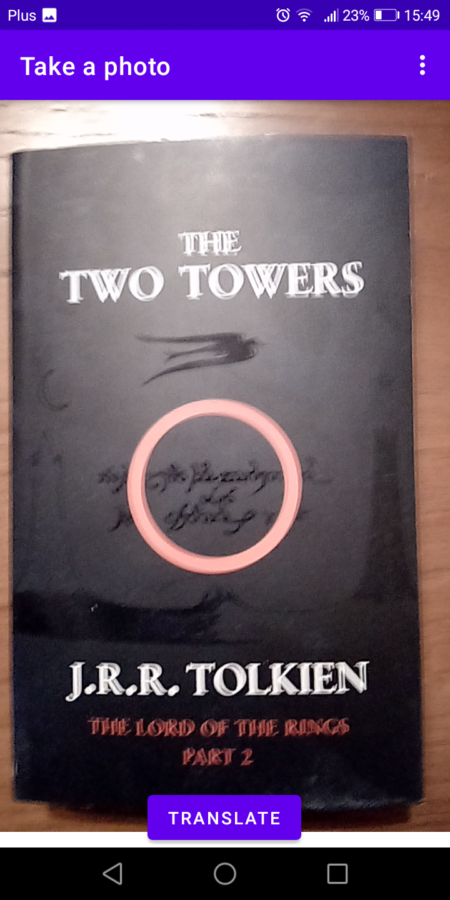
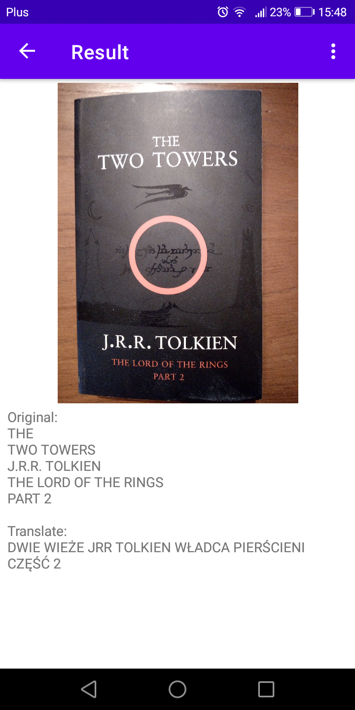
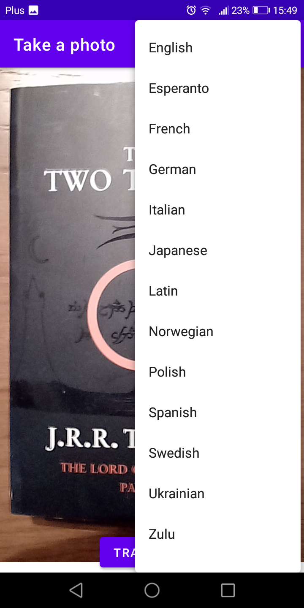

# TranslateApp

**TranslateApp** is an app made for the Techniki Multimedialne subject. Application uses google libraries to detect text on photo and then uses cloud google to translate text from photo. 

**Status** - Project completed

## Table of contents

* Author
* Technologies
* General info
* Screenshots and action video
* Text recognition and translation test results

## Author
[Marek Frańczak](https://github.com/marekfranczak)

## Technologies and Hardware
* Java 1.8 [Java progamming language](https://www.java.com/)
* Android Studio Dolphin | 2021.3.1 Patch 1 [Integrated development environment for Android operation system](https://developer.android.com/studio)
* Cloud Google Platform [Suite of cloud computing services from Google](https://cloud.google.com/)
* ML Kit [Machine learning libraries for mobile devices](https://developers.google.com/ml-kit?hl=en)

## General info
The application works on the phone with the android system (8.0+). Application that allows you to take a picture, scan it for text, and instantly translate it using the power of MLKit and Google Cloud Translation. Simply snap a photo, and app will use MLKit to recognize and extract any text in the image. That text will then be sent to the Google Cloud Translation API for instant translation into your desired language. The final result is displayed on the screen, including the original image, the original text, and the translated text. This app makes it easy to understand foreign languages, whether you're traveling abroad or trying to read a menu at a restaurant.

## Screenshots and action video

**Gif with working app**

**First screen**

**Secong screen**

**Language selection**

## License
For open source projects, say how it is licensed.
